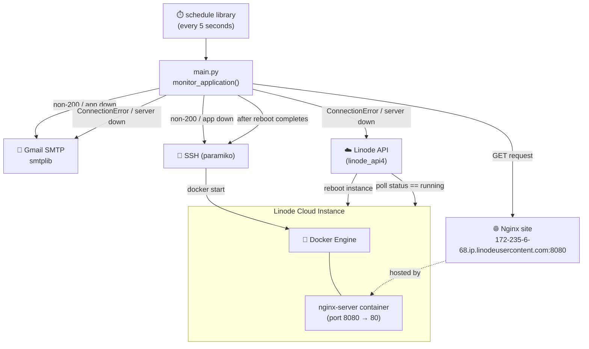
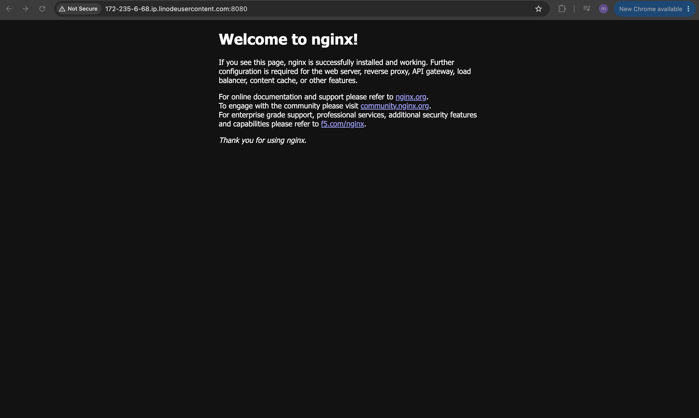
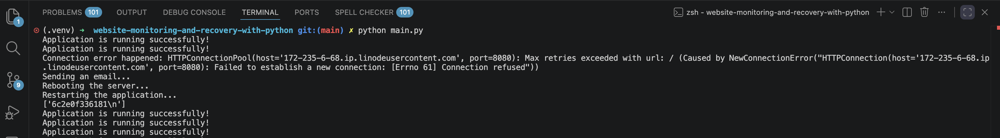
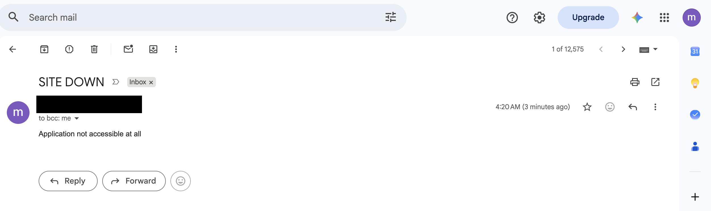

# Website Monitoring and Recovery with Python

**Python** can be used as scripting tool to continuously monitor a live web application, detect outages by validating its HTTP responses, and automatically remediate those outages — restarting the containerized application or, if the whole server is unreachable, rebooting the underlying cloud instance and restarting the application on it. This is a class of problem that is a poor fit for declarative infrastructure-as-code tools: monitoring is an ongoing, stateful, conditional process (check → decide → act → repeat), not a one-time resource provisioning step, which is exactly the kind of recurring operational logic Python excels at.

## Overview

This project demonstrates a **self-healing website monitoring pipeline** built entirely with Python, running against a real Nginx web server hosted on a Linode cloud instance and served through a Docker container. A single scheduled Python script continuously polls the site over HTTP, and reacts differently depending on *how* it fails: if the container responds with a non-200 status code, the script emails an alert and restarts just the Docker container over SSH; if the server is completely unreachable (e.g. the whole VM is down), the script emails an alert, reboots the Linode instance itself via the Linode API, waits for it to come back online, and then restarts the container — fully automating an incident-response runbook that would otherwise require a human to notice the outage and manually intervene.

### Python Automation key features

- 🩺 **Continuous HTTP health checks** — `monitor_application()` uses the `requests` library to poll the Nginx endpoint on a recurring schedule and inspects the HTTP status code to decide whether the site is healthy.
- 📧 **Automated email alerting** — `send_notification()` uses Python's built-in `smtplib` to send a "SITE DOWN" email over Gmail's SMTP server the moment a failure is detected, so the on-call engineer is notified without watching a dashboard.
- 🔁 **Two-tier, failure-aware recovery** — the script distinguishes between an *application-level* failure (container crashed but server is up, handled by `restart_container()`) and a *total connection failure* (server itself is down, handled by `restart_server_and_container()`), applying the least disruptive fix necessary for the situation.
- 🔐 **Remote container restarts over SSH** — `restart_container()` uses `paramiko` to open an SSH session to the remote Linode server and run `docker start` directly, with no manual login required.
- ☁️ **Programmatic server reboot via the Linode API** — `restart_server_and_container()` uses the `linode_api4` SDK to reboot the cloud instance itself when it's completely unresponsive, then polls the instance status until it reports `running` before restarting the application.
- 🔑 **Secrets kept out of source code** — email credentials, the Linode API token, and the SSH key path are all loaded from environment variables via `python-dotenv`, keeping sensitive values out of version control.
- ⏱️ **Unattended, scheduled execution** — the `schedule` library drives the whole monitor loop, checking the site's health automatically every few minutes for as long as the script runs.

## Demo Project

Website Monitoring and Recovery with Python

## Technologies used

- Python
- Linode
- Docker
- Linux

## Project Description

- Create a server on a cloud platform
- Install Docker and run a Docker container on the remote server
- Write a Python script that monitors the website by accessing it and validating the HTTP response
- Write a Python script that sends an email notification when website is down
- Write a Python script that automatically restarts the application & server when the application is down

## Repository structure

```text
website-monitoring-and-recovery-with-python/
├── README.md          # This file
├── NOTES.md           # Raw study notes this project was built from
├── main.py            # Combined monitoring, alerting & recovery script
├── .env               # Local environment variables (gitignored, never committed)
├── example.env        # Template showing which environment variables are required
├── .gitignore         # Excludes .env, Terraform artifacts, and OS files from version control
└── images/            # Screenshots referenced in this README
    ├── nginx-browser.png            # Browser: default Nginx welcome page served from the Linode instance
    ├── website-monitor-terminal.png # Terminal: main.py detecting an outage and self-healing
    └── site-down-email.png          # Gmail inbox: automated "SITE DOWN" alert email
```

> 🔒 **Security note:** All credentials (Gmail address/app password, Linode API token, SSH private key path) are read from environment variables via `python-dotenv` rather than hardcoded in `main.py`. `.env` is excluded from version control by `.gitignore`, and only `example.env` — containing placeholder values and links to where real credentials should be generated — is committed to the repository.

## Architecture overview



- A **Linode server** hosts a **Docker** container running the official **Nginx** image, exposed on port `8080`.
- `main.py` runs continuously and, every 5 minutes, sends an HTTP `GET` request to the site's public Linode hostname.
- If the response status code isn't `200`, the script treats this as an **application-level failure**: it sends an email alert and restarts only the Docker container over SSH — the fastest, least disruptive fix.
- If the request raises a connection error entirely (the server itself is unreachable), the script treats this as a **server-level failure**: it sends an email alert, reboots the entire Linode instance via the Linode API, polls the instance status until it's back to `running`, and only then restarts the container — since the container obviously can't be started while its host is rebooting.
- This two-tier design means the script always applies the smallest possible remediation for the type of failure observed, rather than always reaching for a full server reboot.

## Implementation Guide

### 1. Prerequisites

Before running this project, make sure you have:

- ✅ A **[Linode](https://www.linode.com/)** account — Linode is a cloud computing platform that provides on-demand virtual machines ("Linodes"), object storage, and managed Kubernetes, similar to AWS EC2 or DigitalOcean Droplets.
- ✅ A Linode server (Linode instance) already provisioned and reachable over SSH.
- ✅ **Docker** installed on that server, per the official [Docker Engine installation guide for Debian](https://docs.docker.com/engine/install/debian/).
- ✅ **Python 3** installed locally.
- ✅ A **Gmail account** with an [App Password](https://myaccount.google.com/apppasswords) generated (required when 2-Factor Authentication is enabled, since Gmail no longer allows plain password SMTP login for third-party apps).
- ✅ A **Linode API token**, generated from the [Linode Cloud Manager API tokens page](https://cloud.linode.com/profile/tokens).
- ✅ An **SSH key pair** whose public key is authorized on the Linode server, so `paramiko` can authenticate without a password prompt.

```bash
# verify tool versions
python3 --version

# verify you can reach and authenticate to the Linode server over SSH
ssh -i /path/to/id_ed25519 root@<server-ip>
```

### 2. Provision the server and install Docker

A Linode instance is created through the Linode Cloud Manager, then Docker is installed on it following Docker's official APT repository instructions for Debian:

```bash
# Add Docker's official GPG key:
sudo apt update
sudo apt install ca-certificates curl
sudo install -m 0755 -d /etc/apt/keyrings
sudo curl -fsSL https://download.docker.com/linux/debian/gpg -o /etc/apt/keyrings/docker.asc
sudo chmod a+r /etc/apt/keyrings/docker.asc

# Add the repository to Apt sources:
sudo tee /etc/apt/sources.list.d/docker.sources <<EOF
Types: deb
URIs: https://download.docker.com/linux/debian
Suites: $(. /etc/os-release && echo "$VERSION_CODENAME")
Components: stable
Architectures: $(dpkg --print-architecture)
Signed-By: /etc/apt/keyrings/docker.asc
EOF

sudo apt update
sudo apt install docker-ce docker-ce-cli containerd.io docker-buildx-plugin docker-compose-plugin
```

### 3. Run the Nginx container

With Docker installed, an [Nginx](https://nginx.org/) container — a high-performance, open-source web server and reverse proxy — is started and its internal port `80` is mapped to `8080` on the host:

```bash
sudo docker run -d -p 8080:80 --name nginx-server nginx
```

Visiting the server's public hostname on port `8080` in a browser confirms Nginx is up and serving its default welcome page:



### 4. Install the Python dependencies

The monitoring script relies on several libraries: `requests` for HTTP health checks, `paramiko` for [SSH](https://www.paramiko.org/) automation, `linode_api4` for the [Linode API](https://www.linode.com/docs/api/), `schedule` for the recurring check loop, and `python-dotenv` to load credentials from a `.env` file.

```bash
pip install requests
pip install paramiko
pip install linode_api4
pip install schedule
pip install python-dotenv
```

### 5. Configure environment variables

Following the principle of never hardcoding secrets in source code, all credentials are loaded via Python's `os` module from environment variables populated by a local `.env` file (excluded from version control). `example.env` documents exactly which variables are required and where to obtain each one:

```bash
EMAIL_ADDRESS=mail@gmail.com
EMAIL_PASSWORD=password from https://myaccount.google.com/apppasswords
LINODE_TOKEN=linode token from https://cloud.linode.com/profile/tokens
KEY_FILENAME=/Users/username/.ssh/id_ed25519
```

Copy this template to a real `.env` file and fill in actual values:

```bash
cp example.env .env
```

- `EMAIL_ADDRESS` / `EMAIL_PASSWORD` — the Gmail account and [App Password](https://myaccount.google.com/apppasswords) used to authenticate with Gmail's SMTP server and send alert emails.
- `LINODE_TOKEN` — a personal access token from the [Linode Cloud Manager](https://cloud.linode.com/profile/tokens), used by `linode_api4` to authenticate API calls like rebooting the instance.
- `KEY_FILENAME` — the local path to the private SSH key authorized on the Linode server, used by `paramiko` to connect without a password prompt.

### 6. Write the monitoring, alerting & recovery script

`main.py` combines HTTP health checking, email alerting, and two tiers of automated recovery into a single scheduled script:

```py
import requests
import smtplib
import os
import paramiko
import linode_api4
import time
import schedule
import dotenv

dotenv.load_dotenv()

EMAIL_ADDRESS = os.environ.get('EMAIL_ADDRESS')
EMAIL_PASSWORD = os.environ.get('EMAIL_PASSWORD')
LINODE_TOKEN = os.environ.get('LINODE_TOKEN')
KEY_FILENAME = os.environ.get('KEY_FILENAME')


def restart_server_and_container():
    # restart linode server
    print('Rebooting the server...')
    client = linode_api4.LinodeClient(LINODE_TOKEN)
    nginx_server = client.load(linode_api4.Instance, 106818789)
    nginx_server.reboot()

    # restart the application
    while True:
        nginx_server = client.load(linode_api4.Instance, 106818789)
        if nginx_server.status == 'running':
            time.sleep(5)
            restart_container()
            break


def send_notification(email_msg):
    print('Sending an email...')
    with smtplib.SMTP('smtp.gmail.com', 587) as smtp:
        smtp.starttls()
        smtp.ehlo()
        smtp.login(EMAIL_ADDRESS, EMAIL_PASSWORD)
        message = f"Subject: SITE DOWN\n{email_msg}"
        smtp.sendmail(EMAIL_ADDRESS, EMAIL_ADDRESS, message)


def restart_container():
    print('Restarting the application...')
    ssh = paramiko.SSHClient()
    ssh.set_missing_host_key_policy(paramiko.AutoAddPolicy())
    ssh.connect(hostname='172.235.6.68', username='root', key_filename=KEY_FILENAME)
    stdin, stdout, stderr = ssh.exec_command('docker start 6c2e0f336181')
    print(stdout.readlines())
    ssh.close()


def monitor_application():
    try:
        response = requests.get('http://172-235-6-68.ip.linodeusercontent.com:8080/')
        if response.status_code == 200:
            print('Application is running successfully!')
        else:
            print('Application Down. Fix it!')
            msg = f'Application returned {response.status_code}'
            send_notification(msg)
            restart_container()
    except Exception as ex:
        print(f'Connection error happened: {ex}')
        msg = 'Application not accessible at all'
        send_notification(msg)
        restart_server_and_container()


schedule.every(5).seconds.do(monitor_application)

while True:
    schedule.run_pending()
```

- `dotenv.load_dotenv()` reads the local `.env` file and injects its key-value pairs into the process environment, which `os.environ.get(...)` then reads — keeping every credential out of the script itself.
- `monitor_application()` is the entry point: it wraps the HTTP check in a `try/except` so that a completely failed connection (server down) is handled differently from a successful connection that simply returns a bad status code (application down).
- On an application-level failure (non-200 response), only `send_notification()` and `restart_container()` run — the lightest-touch fix, since the server itself is clearly still reachable.
- On a total connection failure, both `send_notification()` and `restart_server_and_container()` run — which reboots the Linode instance via `linode_api4`, polls `nginx_server.status` in a loop until it reports `'running'`, waits a few extra seconds for the OS/Docker daemon to fully come up, and only then calls `restart_container()`.
- `restart_container()` opens a `paramiko` SSH session with `AutoAddPolicy()` (auto-accepting the host key, appropriate for a single-purpose automation script against a known server) and runs `docker start <container-id>` remotely — no manual login needed.
- `schedule.every(5).seconds.do(monitor_application)` combined with the `while True: schedule.run_pending()` loop is what keeps the health check running indefinitely, once every 5 minutes.

Run it with:

```bash
python main.py
```

### 7. Trigger and observe the recovery workflow

To validate the recovery paths, the Nginx container and/or the Linode server were deliberately stopped while `main.py` was running. The terminal output shows the script detecting the outage, sending an alert, and self-healing automatically:



At the same time, the configured Gmail inbox receives the automated outage notification within seconds of the failure being detected:



## Final result

By combining these components, the following was achieved:

- ✅ A live Nginx web application running in Docker on a Linode cloud server, continuously monitored over HTTP.
- ✅ Instant, automated email alerts the moment the site becomes unreachable or returns an unhealthy status code — with no human needing to be actively watching.
- ✅ A two-tier, failure-aware self-healing mechanism: a lightweight container restart for application-level failures, and a full instance reboot plus container restart for total server outages.
- ✅ Verified, screenshot-backed proof of the entire incident lifecycle — from the healthy Nginx page, through the detected outage and email alert in the terminal, to the received alert email itself.
- ✅ Credentials (Gmail app password, Linode API token, SSH key path) kept entirely out of source control via environment variables and a `.gitignore`'d `.env` file.

This pattern mirrors real-world site reliability engineering (SRE) practice: cheap, frequent synthetic health checks; alerting that fires before a customer notices; and automated, graduated remediation that only escalates to a full reboot when a lighter-touch fix wouldn't work.

## References

- [Linode Cloud Manager Documentation](https://www.linode.com/docs/)
- [Linode API Reference](https://www.linode.com/docs/api/)
- [`linode_api4` Python library documentation](https://www.linode.com/docs/products/tools/api/guides/linode-api4-python-library/)
- [Docker Engine installation guide for Debian](https://docs.docker.com/engine/install/debian/)
- [Official Nginx Docker image](https://hub.docker.com/_/nginx)
- [Python `requests` library documentation](https://requests.readthedocs.io/)
- [Python `smtplib` documentation](https://docs.python.org/3/library/smtplib.html)
- [Gmail App Passwords](https://myaccount.google.com/apppasswords)
- [`paramiko` SSH library documentation](https://www.paramiko.org/)
- [Python `schedule` library documentation](https://schedule.readthedocs.io/en/stable/)
- [`python-dotenv` documentation](https://saurabh-kumar.com/python-dotenv/)
