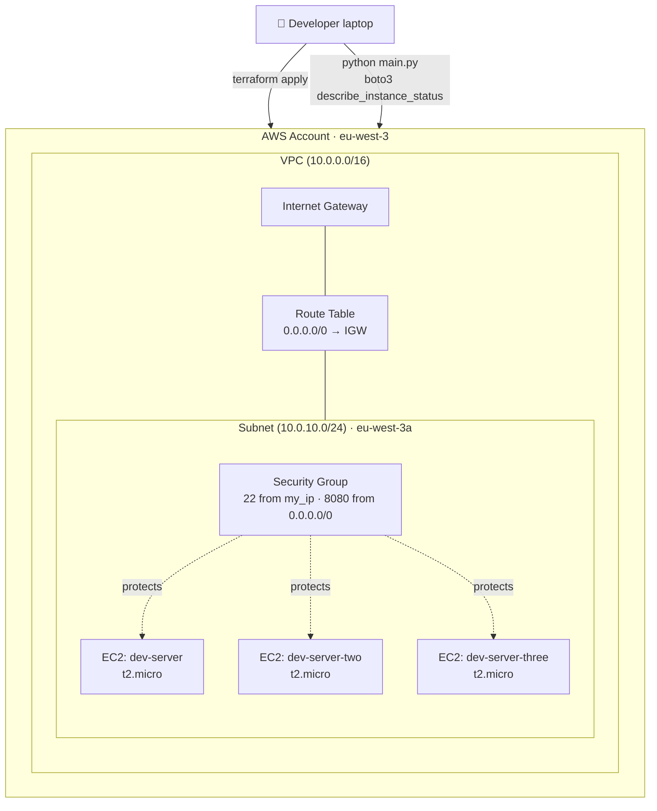
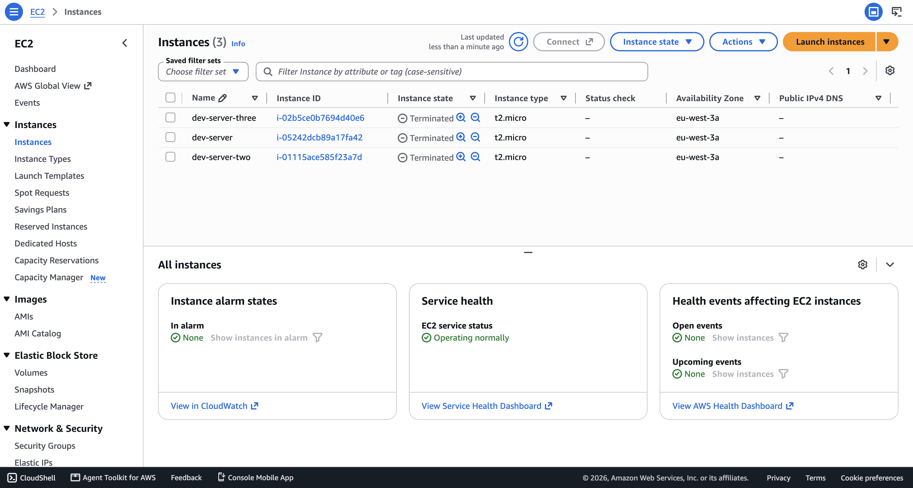
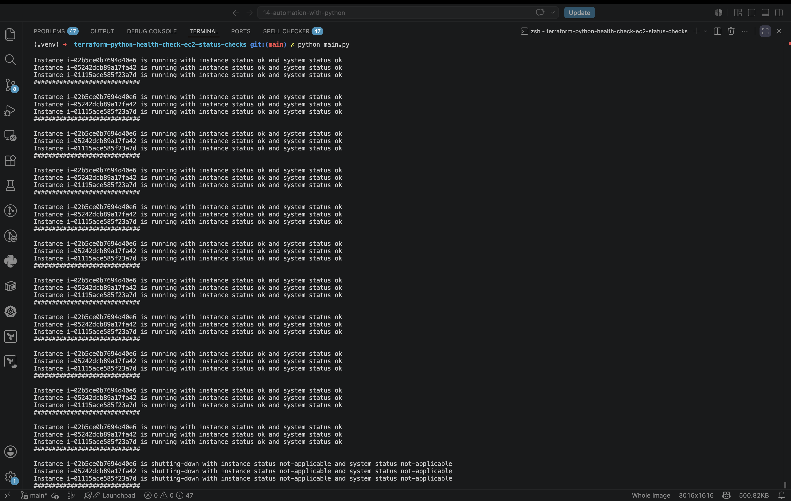

# Health Check: EC2 Status Checks with Terraform and Python

**Terraform** is an infrastructure as code (IaC) tool created by HashiCorp that lets you define, provision, and manage both cloud and on-prem resources through human-readable, declarative configuration files. Instead of clicking through a console or writing imperative scripts, you describe the *desired end state* of your infrastructure, and Terraform figures out the plan needed to create, update, or destroy resources to match it — through a repeatable **Write → Plan → Apply** workflow. It talks to cloud platforms (AWS, Azure, GCP, and hundreds more) through *providers*, which map Terraform configuration to each platform's API.

**Python Automation**, in the context of this project, refers to using the **Python** programming language together with **Boto3** (the AWS SDK for Python) to imperatively interact with already-provisioned AWS resources — querying their live state, applying custom logic, and repeating that logic on a schedule. Where Terraform is declarative and idempotent (great for *provisioning*), Python is imperative and flexible (great for *operational tasks* like health checks, reporting, and integrating with other systems). Boto3 exposes both a low-level **client** (a 1:1 mapping to AWS service APIs) and a higher-level, object-oriented **resource** interface for working with services such as EC2, S3, and VPC.

## Overview

This project demonstrates a DevOps workflow that combines two complementary tools: **Terraform** for provisioning immutable, version-controlled infrastructure, and **Python (Boto3)** for the day-2 operational task of monitoring that infrastructure. Three EC2 instances are provisioned from scratch — including their own VPC, subnet, internet gateway, route table, and security group — and a Python script is then used to continuously poll the AWS EC2 API and report the health of every instance directly in the terminal, on a fixed interval, without any manual intervention.

The goal is to showcase the practical difference between *declarative infrastructure provisioning* and *imperative operational automation*, and how both fit naturally into a single DevOps toolchain.

### Python Automation key features

- 🔌 **Direct AWS API access** via `boto3.client('ec2', ...)` — no extra tooling or agents required on the instances themselves.
- 🔁 **Continuous, scheduled polling** using the `schedule` library, so the script re-checks every instance automatically on a fixed interval instead of running once and exiting.
- 🩺 **Dual health signal reporting** — surfaces both the **instance status check** (guest OS/network level) and the **system status check** (underlying AWS hardware/host level) for every instance in one call.
- 🗂️ **Bulk querying** with `IncludeAllInstances=True`, returning status for *all* instances (running, stopping, stopped, etc.) instead of only running ones.
- 🖨️ **Human-readable console output** — one line per instance per check, clearly separated per polling cycle, making it easy to eyeball instance health during a demo or an incident.
- 🧩 **Composable by design** — the same `check_instance_status()` function could be pointed at Slack, email, or CloudWatch instead of `print()`, with almost no changes.

## Demo Project

Terraform Python Health Check: EC2 Status Checks

## Technologies used

- Python
- Boto3
- AWS
- Terraform

## Project Description

- Create EC2 Instances with Terraform
- Write a Python script that fetches statuses of EC2 Instances and prints to the console
- Extend the Python script to continuously check the status of EC2 Instances in a specific interval

## Repository structure

```text
terraform-python-health-check-ec2-status-checks/
├── README.md                                    # This file
├── NOTES.md                                     # Raw study notes this project was built from
├── main.py                                      # Python health-check script (boto3 + schedule)
├── images/                                      # Screenshots referenced in this README
│   ├── terraform-ec2-instances-aws-console.png  # AWS console view of the provisioned instances
│   └── python-ec2-status-terminal.png           # Terminal output of the running health-check script
└── terraform/                                   # Terraform IaC for the demo environment
    ├── main.tf                                  # VPC, subnet, IGW, route table, SG, key pair, 3x EC2 instances
    ├── providers.tf                             # Terraform + AWS provider version pinning
    ├── entry-script.sh                          # EC2 user-data: installs Docker & runs nginx on port 8080
    ├── example.tfvars                           # Template variable file (safe to commit, tracked in git)
    ├── terraform.tfvars                         # Real variable values (git-ignored, contains env values)
    ├── terraform.tfstate                        # Local Terraform state (git-ignored)
    └── terraform.tfstate.backup                 # Local Terraform state backup (git-ignored)
```

> 🔒 **Security note:** `.gitignore` excludes every `*.tfvars` file except `example.tfvars`, along with all `*.tfstate*` files. This keeps sensitive values (your workstation IP, key paths) and state — which can contain resource metadata — out of version control, following Terraform's own recommended practice for handling sensitive data.

## Architecture overview



- **Terraform** provisions the networking layer (VPC, subnet, internet gateway, route table) and the compute layer (security group, SSH key pair, and three `t2.micro` EC2 instances) in one `apply`.
- Each instance boots from the latest **Amazon Linux 2 AMI** (looked up dynamically via a `data "aws_ami"` filter, so the AMI ID is never hardcoded) and runs `entry-script.sh` as `user_data` to install Docker and start an `nginx` container on port `8080`.
- **Python + Boto3** then sits *outside* the Terraform lifecycle entirely — it does not create or destroy anything, it only reads. It calls `ec2_client.describe_instance_status(IncludeAllInstances=True)` on a schedule and prints the **instance state**, **instance status check**, and **system status check** for every instance in the account/region.
- AWS EC2 status checks come in four types — **system**, **instance**, **attached EBS**, and **application** — with system, instance, and attached EBS checks running automatically every minute and returning an overall `ok`/`impaired` result per instance. This project focuses on the **system** and **instance** checks, which are the two returned in every `describe_instance_status` response.

## Implementation Guide

### 1. Prerequisites

Before running this project, make sure you have:

- ✅ An **AWS account** with an IAM user/role that has permissions to manage VPCs, subnets, security groups, key pairs, and EC2 instances.
- ✅ The **AWS CLI** installed and configured with valid credentials (`aws configure`), since both Terraform's AWS provider and Boto3 rely on the same default credential chain.
- ✅ **Terraform** installed locally (this project was built and pinned against the `hashicorp/aws` provider `~> 5.20.1`).
- ✅ **Python 3** installed locally.
- ✅ An **SSH key pair** already generated on your machine (e.g. `~/.ssh/id_rsa.pub`), since Terraform uploads your **public** key to AWS to allow SSH access to the instances.
- ✅ Your **workstation's public IP address** (e.g. via `curl ifconfig.me`), used to lock down SSH access in the security group.

```bash
# verify tool versions
terraform -version
python3 --version
aws --version

# verify AWS credentials are wired up correctly
aws sts get-caller-identity

# grab your public IP for the security group rule
curl ifconfig.me
```

### 2. Provision the infrastructure with Terraform

The `terraform/main.tf` file declares the full networking + compute stack for this demo:

```tf
provider "aws" {
  region = "eu-west-3"
}

data "aws_ami" "amazon-linux-image" {
  most_recent = true
  owners      = ["amazon"]

  filter {
    name   = "name"
    values = ["amzn2-ami-hvm-*-x86_64-gp2"]
  }

  filter {
    name   = "virtualization-type"
    values = ["hvm"]
  }
}

resource "aws_vpc" "myapp-vpc" { ... }
resource "aws_subnet" "myapp-subnet-1" { ... }
resource "aws_security_group" "myapp-sg" { ... }        # 22 from my_ip, 8080 from 0.0.0.0/0
resource "aws_internet_gateway" "myapp-igw" { ... }
resource "aws_route_table" "myapp-route-table" { ... }
resource "aws_route_table_association" "a-rtb-subnet" { ... }
resource "aws_key_pair" "ssh-key" { ... }

resource "aws_instance" "myapp-server"       { ... }    # 3 identical t2.micro instances,
resource "aws_instance" "myapp-server-two"   { ... }    # each running entry-script.sh
resource "aws_instance" "myapp-server-three" { ... }    # as user_data on boot
```

`entry-script.sh` is the `user_data` payload each instance runs on first boot, installing Docker and starting an `nginx` container so the instances have a real, observable workload:

```bash
#!/bin/bash
sudo yum update -y && sudo yum install -y docker
sudo systemctl start docker
sudo usermod -aG docker ec2-user
docker run -p 8080:80 nginx
```

Copy the example variables file and fill in your own values before applying:

```bash
cd terraform
cp example.tfvars terraform.tfvars
```

```hcl
# terraform.tfvars
vpc_cidr_block       = "10.0.0.0/16"
subnet_cidr_block    = "10.0.10.0/24"
avail_zone           = "eu-west-3a"
env_prefix           = "dev"
my_ip                = "YOUR_IP/32"
instance_type        = "t2.micro"
public_key_location  = "PATH_TO_PUB_KEY"
```

Then initialize and apply the configuration:

```bash
terraform init
terraform plan -var-file terraform.tfvars
terraform apply -var-file terraform.tfvars --auto-approve
```

Once `apply` finishes, Terraform prints the `ami_id` and `server-ip` outputs, and the three instances are visible in the AWS console:



*(The instances shown above were later terminated with `terraform destroy` as part of routine demo clean-up, to avoid unnecessary AWS charges — the console still confirms all three were successfully created by Terraform under the `dev-*` naming convention.)*

### 3. Install the Python dependencies

The health-check script relies on two third-party packages: **Boto3** for the AWS API calls, and **schedule** for the recurring job loop.

```bash
pip install boto3
pip install schedule
```

### 4. Write the EC2 health-check script

`main.py` uses a Boto3 **client** (low-level, direct API mapping) to call `describe_instance_status`, then loops over every instance and prints its state alongside both status-check results:

```py
import boto3
import schedule

ec2_client = boto3.client('ec2', region_name="eu-west-3")
ec2_resource = boto3.resource('ec2', region_name="eu-west-3")


def check_instance_status():
    statuses = ec2_client.describe_instance_status(
        IncludeAllInstances=True
    )
    for status in statuses['InstanceStatuses']:
        ins_status = status['InstanceStatus']['Status']
        sys_status = status['SystemStatus']['Status']
        state = status['InstanceState']['Name']
        print(f"Instance {status['InstanceId']} is {state} with instance status {ins_status} and system status {sys_status}")
    print("#############################\n")


schedule.every(5).minutes.do(check_instance_status)

while True:
    schedule.run_pending()
```

- `IncludeAllInstances=True` ensures instances that are `stopped`, `stopping`, or `shutting-down` are still reported, not just `running` ones — useful for catching an instance that unexpectedly went down.
-- `schedule.every(5).minutes.do(check_instance_status)` registers the function as a recurring job; the `while True: schedule.run_pending()` loop is what actually keeps the script alive and triggers the job whenever it's due.

### 5. Run and test the health-check script

With the infrastructure up and dependencies installed, simply run the script:

```bash
python main.py
```

The script polls every 20 seconds and prints a fresh health report for all three instances on every cycle, right until the instances are stopped/terminated — at which point the status flips to `not-applicable`, confirming the script correctly reflects real-time instance state:



To stop the script, press `Ctrl+C` in the terminal. To tear down the AWS infrastructure once you're done testing:

```bash
cd terraform
terraform destroy -var-file terraform.tfvars --auto-approve
```

## Final result

By combining Terraform and Python in this project, the following was achieved:

- ✅ A fully reproducible, version-controlled AWS environment (VPC, subnet, routing, security group, and 3 EC2 instances) stood up with a single `terraform apply`.
- ✅ A lightweight, dependency-free (beyond `boto3` + `schedule`) Python script capable of continuously monitoring the health of *any* number of EC2 instances in a region, without needing SSH access or an agent installed on the instances themselves.
- ✅ Clear, human-readable visibility into both **instance-level** and **system-level** AWS status checks, printed to the console every 5 minutes.
- ✅ A practical demonstration of *when to reach for Terraform* (predictable, repeatable infrastructure provisioning) versus *when to reach for Python* (flexible, imperative operational automation and monitoring).

This pattern scales directly into production use cases such as feeding instance health into a Slack/PagerDuty alert, a CloudWatch custom metric, or a broader in-house monitoring dashboard.

## References

- [Terraform Documentation — What is Terraform?](https://developer.hashicorp.com/terraform/intro)
- [Terraform AWS Provider Registry](https://registry.terraform.io/providers/hashicorp/aws/latest/docs)
- [AWS Boto3 Documentation](https://boto3.amazonaws.com/v1/documentation/api/latest/index.html)
- [Boto3 EC2 Client — `describe_instance_status`](https://boto3.amazonaws.com/v1/documentation/api/latest/reference/services/ec2/client/describe_instance_status.html)
- [AWS EC2 User Guide — Status checks for Amazon EC2 instances](https://docs.aws.amazon.com/AWSEC2/latest/UserGuide/monitoring-system-instance-status-check.html)
- [Python `schedule` library documentation](https://schedule.readthedocs.io/en/stable/)
- [AWS CLI — Configuration basics](https://docs.aws.amazon.com/cli/latest/userguide/cli-configure-files.html)
