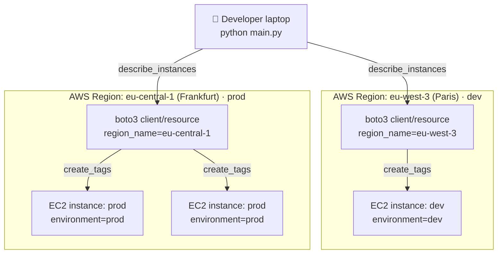
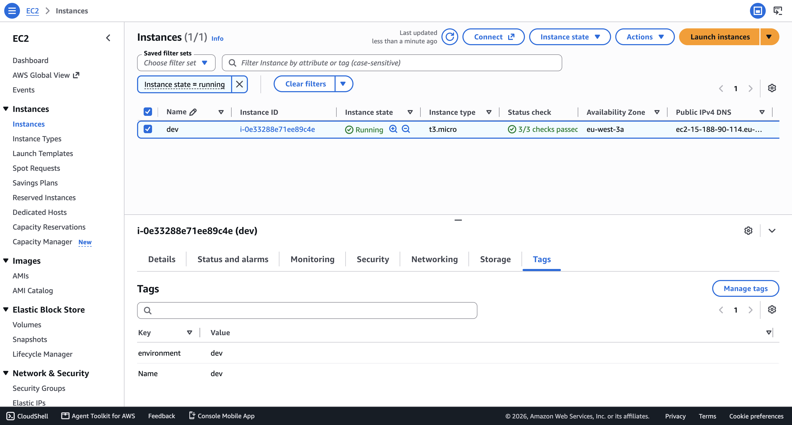
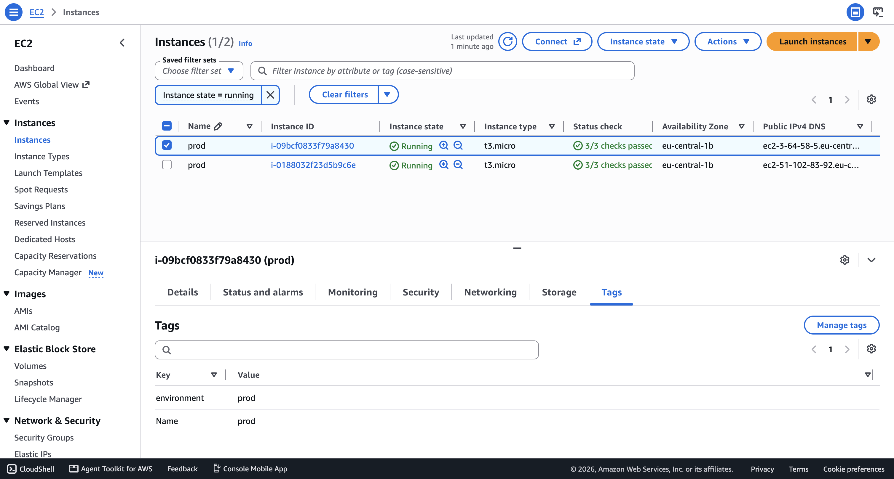

# Automate configuring EC2 Server Instances with Python

**Boto3** is the official AWS SDK for Python, published and maintained by Amazon. It gives Python developers a direct, programmatic way to create, configure, and manage AWS resources — such as EC2 instances, S3 buckets, and VPCs — through a low-level **client** (a 1:1 mapping to each AWS service's API) or a higher-level, object-oriented **resource** interface. Boto3 is the engine that powers this project's ability to reach into multiple AWS regions and apply configuration changes directly through code.

**Python Automation**, in the context of this project, refers to using the **Python** programming language together with **Boto3** to imperatively configure already-provisioned AWS resources — discovering them at runtime, applying custom business logic (such as an organization's environment-naming convention), and repeating that logic consistently across regions and accounts. Unlike declarative infrastructure-as-code tools, Python scripts like this one are best suited for *operational, day-2 configuration tasks*: enforcing tagging standards, bulk-editing resource metadata, and integrating AWS with other internal systems.

## Overview

This project demonstrates how to use Python and Boto3 to automatically configure existing EC2 server instances by applying consistent **environment tags** across multiple AWS regions. Many organizations run infrastructure across several regions to serve different environments — for example, a **development** environment in `eu-west-3` (Paris) and a **production** environment in `eu-central-1` (Frankfurt) — and rely on consistent tagging to identify, filter, and manage those resources at scale.

The Python script in this repository connects to both regions, discovers every EC2 instance already running there, and stamps each one with an `environment` tag (`dev` or `prod`) reflecting its region's purpose — turning a manual, error-prone console task into a single, repeatable script execution.

### Python Automation key features

- 🌍 **Multi-region orchestration** — separate `boto3.client()` / `boto3.resource()` pairs are created for `eu-west-3` and `eu-central-1`, so a single script run can configure resources across an entire multi-region footprint.
- 🔎 **Dynamic instance discovery** via `describe_instances()` — the script doesn't hardcode instance IDs; it walks the `Reservations` → `Instances` structure returned by the API to find every instance currently in each region.
- 🏷️ **Bulk tagging in a single API call** using `create_tags()`, applying the same `environment` tag to every discovered instance ID in one request per region instead of looping over individual `create_tags` calls.
- 🧭 **Environment-based convention** — a simple, consistent `environment: dev` / `environment: prod` key-value pair that makes resources instantly filterable in the AWS console, CLI, or cost-allocation reports.
- 🧩 **Composable by design** — the same discover-then-tag pattern can be extended to any other tag (`Owner`, `CostCenter`, `Team`) or any other taggable AWS resource type with minimal changes.

## Demo Project

Automate configuring EC2 Server Instances with Python

## Technologies used

- Python
- Boto3
- AWS

## Project Description

- Write a Python script that automates adding environment tags to all EC2 Server instances

## Repository structure

```text
automate-configuring-ec2-server-instances-with-python/
├── README.md                                     # This file
├── NOTES.md                                      # Raw study notes this project was built from
├── main.py                                       # Python tagging script (boto3, multi-region)
├── .gitignore                                    # Excludes local Terraform/AWS artifacts and secrets
└── images/                                       # Screenshots referenced in this README
    ├── ec2-instances-tags-dev-aws-console.png    # AWS console: `dev` instance tagged in eu-west-3
    └── ec2-instances-tags-prod-aws-console.png   # AWS console: `prod` instances tagged in eu-central-1
```

> 🔒 **Security note:** This script relies on the AWS SDK's default credential chain (environment variables, shared `~/.aws/credentials` file, or an IAM role) rather than hardcoded access keys, so no secrets ever need to live in the source code or in version control.

## Architecture overview



- The script opens **two independent Boto3 sessions**, one per AWS region — `eu-west-3` for the development environment and `eu-central-1` for production — since Boto3 clients and resources are always scoped to a single region.
- For each region, `describe_instances()` returns a paginated list of `Reservations`, each containing one or more `Instances`; the script flattens this structure into a simple list of `InstanceId` values.
- `ec2_resource.create_tags(Resources=[...], Tags=[...])` is then called **once per region** with the full list of discovered instance IDs, applying the `environment` tag to every instance in that region in a single API round-trip rather than one call per instance.
- Because tagging is applied by `InstanceId` rather than by name or state filter, the script naturally covers every instance in the region regardless of its current running state.

## Implementation Guide

### 1. Prerequisites

Before running this project, make sure you have:

- ✅ An **AWS account** with an IAM user/role that has `ec2:DescribeInstances` and `ec2:CreateTags` permissions in both target regions.
- ✅ The **AWS CLI** installed and configured with valid credentials (`aws configure`), since Boto3 relies on the same default credential chain.
- ✅ **Python 3** installed locally.
- ✅ **Boto3** installed (see step 2 below).
- ✅ At least one **EC2 instance already running** in each target region (`eu-west-3` and `eu-central-1`) — this script configures *existing* instances, it does not provision new ones.

```bash
# verify tool versions
python3 --version
aws --version

# verify AWS credentials are wired up correctly
aws sts get-caller-identity

# confirm you have running instances in each target region
aws ec2 describe-instances --region eu-west-3 --query "Reservations[].Instances[].InstanceId"
aws ec2 describe-instances --region eu-central-1 --query "Reservations[].Instances[].InstanceId"
```

### 2. Install the Python dependencies

The tagging script relies on a single third-party package: **Boto3**, for all AWS API calls.

```bash
pip install boto3
```

### 3. Understand the environment-tagging convention

Per the study notes, tags are a lightweight, AWS-native way to categorize resources — for example by purpose, owner, or environment — so they can be identified and filtered later without inspecting each resource individually. This project standardizes on a single tag key, `environment`, with two possible values:

| Region                | Purpose     | `environment` tag value |
| ---------------------- | ----------- | ------------------------ |
| `eu-west-3` (Paris)     | Development | `dev`                     |
| `eu-central-1` (Frankfurt) | Production  | `prod`                     |

### 4. Write the environment-tagging script

`main.py` creates a dedicated Boto3 client/resource pair per region, discovers every instance in that region, then tags them all in one `create_tags` call:

```py
import boto3

ec2_client_frankfurt = boto3.client('ec2', region_name="eu-central-1")
ec2_resource_frankfurt = boto3.resource('ec2', region_name="eu-central-1")

ec2_client_paris = boto3.client('ec2', region_name="eu-west-3")
ec2_resource_paris = boto3.resource('ec2', region_name="eu-west-3")

instance_ids_frankfurt = []
instance_ids_paris = []

reservations_frankfurt = ec2_client_frankfurt.describe_instances()['Reservations']
for res in reservations_frankfurt:
    instances = res['Instances']
    for ins in instances:
        instance_ids_frankfurt.append(ins['InstanceId'])


response = ec2_resource_frankfurt.create_tags(
    Resources=instance_ids_frankfurt,
    Tags=[
        {
            'Key': 'environment',
            'Value': 'prod'
        },
    ]
)

reservations_paris = ec2_client_paris.describe_instances()['Reservations']
for res in reservations_paris:
    instances = res['Instances']
    for ins in instances:
        instance_ids_paris.append(ins['InstanceId'])


response = ec2_resource_paris.create_tags(
    Resources=instance_ids_paris,
    Tags=[
        {
            'Key': 'environment',
            'Value': 'dev'
        },
    ]
)
```

- The **client** (`ec2_client_*`) is used only to *read* state via `describe_instances()`, while the **resource** (`ec2_resource_*`) is used to *write* state via `create_tags()` — a natural split that reflects Boto3's client-vs-resource design.
- Nesting the loop over `Reservations` → `Instances` is required because `describe_instances()` groups instances by the reservation request that launched them, not as a flat list.
- Running the block for Frankfurt first and Paris second means both regions are always fully re-tagged on every execution, regardless of order.

### 5. Run and verify the tags in the AWS console

With Boto3 installed and AWS credentials configured, run the script directly:

```bash
python main.py
```

Verify the results in the **EC2 console → Instances → select an instance → Tags tab** for each region:





## Final result

By using Python and Boto3 in this project, the following was achieved:

- ✅ A single script capable of discovering and tagging **every EC2 instance across two AWS regions** in one execution, with zero manual console clicks.
- ✅ A consistent, organization-wide `environment` tagging convention (`dev` / `prod`) applied automatically and idempotently.
- ✅ Verified, screenshot-backed proof that both the Paris (`dev`) and Frankfurt (`prod`) instances carry the correct tag in the AWS console.
- ✅ A reusable pattern — swap the tag key/value, add more regions, or point the same discover-then-configure approach at other AWS resource types (S3 buckets, EBS volumes, security groups) with minimal code changes.

This pattern scales directly into production use cases such as enforcing tagging compliance across an entire AWS Organization, feeding tag data into cost-allocation reports, or driving tag-based access control (ABAC) policies.

## References

- [AWS Boto3 Documentation](https://boto3.amazonaws.com/v1/documentation/api/latest/index.html)
- [Boto3 EC2 Client — `describe_instances`](https://boto3.amazonaws.com/v1/documentation/api/latest/reference/services/ec2/client/describe_instances.html)
- [Boto3 EC2 Resource — `create_tags`](https://boto3.amazonaws.com/v1/documentation/api/latest/reference/services/ec2/service-resource/create_tags.html)
- [AWS EC2 User Guide — Tag your Amazon EC2 resources](https://docs.aws.amazon.com/AWSEC2/latest/UserGuide/Using_Tags.html)
- [AWS Tagging Best Practices Whitepaper](https://docs.aws.amazon.com/whitepapers/latest/tagging-best-practices/tagging-best-practices.html)
- [AWS CLI — Configuration basics](https://docs.aws.amazon.com/cli/latest/userguide/cli-configure-files.html)
- [AWS Regions and Availability Zones](https://docs.aws.amazon.com/AWSEC2/latest/UserGuide/using-regions-availability-zones.html)

