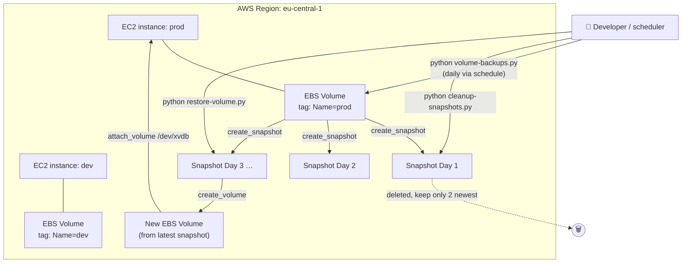
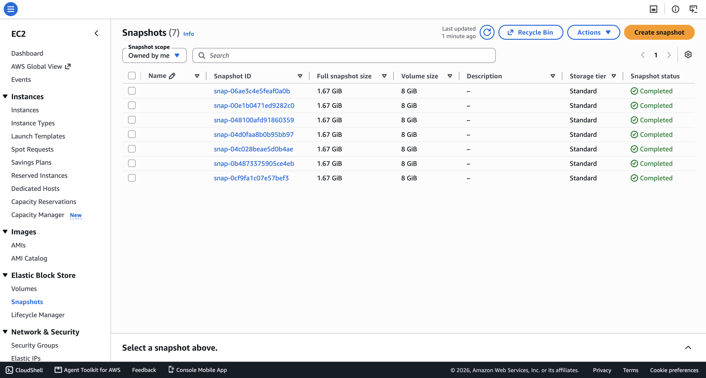
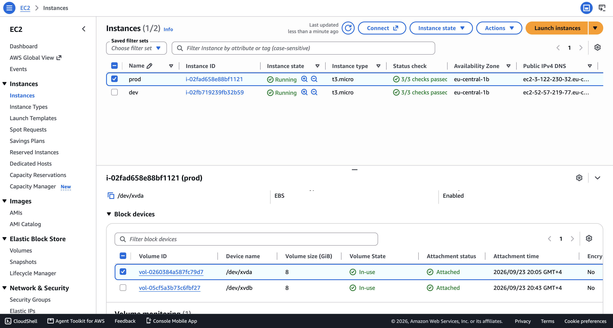

# AWS Data Backup & Restore with Python

**Python Automation**, allows using the **Python** programming language together with **Boto3** (the AWS SDK for Python) to imperatively manage the full lifecycle of EC2 volume backups — creating snapshots on a schedule, pruning old snapshots to control storage cost, and restoring a volume from a snapshot on demand. Where a declarative infrastructure-as-code tool is best suited to *provisioning* resources once, Python is imperative and stateful by nature, making it the right tool for *recurring, conditional, data-driven operational tasks* like backup rotation.

## Overview

This project demonstrates a **backup and disaster-recovery workflow** for Amazon EBS volumes attached to EC2 instances, built entirely with Python and Boto3. Three standalone scripts cover the full lifecycle: `volume-backups.py` runs on a schedule to snapshot every volume tagged as `prod`, `cleanup-snapshots.py` prunes old snapshots down to the two most recent per volume to control storage costs, and `restore-volume.py` recreates a volume from its latest snapshot and reattaches it to a running EC2 instance.

### Python Automation key features

- 🏷️ **Tag-driven targeting** — every script filters volumes using `Filters=[{'Name': 'tag:Name', 'Values': ['prod']}]`, so only volumes explicitly tagged for backup are touched, leaving `dev`/other environments untouched.
- ⏰ **Scheduled, unattended backups** — `volume-backups.py` uses the `schedule` library to trigger `create_snapshot()` once every day automatically, with no cron job or external scheduler required.
- 🧹 **Automated retention/cleanup policy** — `cleanup-snapshots.py` sorts each volume's snapshots by `StartTime` (newest first) and deletes everything beyond the two most recent, keeping storage costs predictable as backups accumulate.
- ♻️ **End-to-end restore workflow** — `restore-volume.py` chains together `describe_volumes` → `describe_snapshots` → `create_volume` → a `while True` readiness poll → `attach_volume`, fully automating what would otherwise be a multi-step, manual console recovery procedure.
- 🩺 **State-aware polling** — the restore script polls `ec2_resource.Volume(...).state` in a loop until AWS reports the newly created volume as `available`, only then attaching it — avoiding a race condition where the volume isn't ready to be attached yet.
- 🧩 **Composable by design** — each script is independent and single-purpose (create, cleanup, or restore), so any one of them can be scheduled, triggered by an event, or wired into a CI/CD pipeline without touching the others.

## Demo Project

AWS Data Backup & Restore with Python

## Technologies used

- Python
- Boto3
- AWS

## Project Description

- Write a Python script that automates creating backups for EC2 Volumes
- Write a Python script that cleans up old EC2 Volume snapshots
- Write a Python script that restores EC2 Volumes

## Repository structure

```text
aws-data-backup-and-restore-with-python/
├── README.md                                        # This file
├── NOTES.md                                         # Raw study notes this project was built from
├── volume-backups.py                                # Scheduled script: snapshots every "prod"-tagged volume daily
├── cleanup-snapshots.py                             # One-shot script: keeps only the 2 most recent snapshots per volume
├── restore-volume.py                                # One-shot script: restores & reattaches a volume from its latest snapshot
└── images/                                           # Screenshots referenced in this README
    ├── snapshots-created-aws-console.png            # AWS console: 7 completed snapshots created by volume-backups.py
    └── volume-restored-from-snapshot-aws-console.png # AWS console: restored volume attached to the "prod" instance
```

> 🔒 **Security note:** This project relies on the AWS SDK's default credential chain (environment variables, shared `~/.aws/credentials` file, or an IAM role) rather than hardcoded access keys, so no secrets ever need to live in the source code or in version control.

## Architecture overview



- Two EC2 instances are created up front and tagged by **Name**: `prod` and `dev`.
- **`volume-backups.py`** runs continuously in the foreground (or as a background/systemd process) and, once per day, calls `describe_volumes` filtered to `tag:Name=prod`, then `create_snapshot()` for each matching volume — leveraging the fact that [EBS snapshots are incremental](https://docs.aws.amazon.com/AWSEC2/latest/UserGuide/EBSSnapshots.html): only the blocks changed since the last snapshot are actually saved, keeping backup time and storage cost low.
- **`cleanup-snapshots.py`** is a one-shot maintenance script — for each `prod`-tagged volume, it fetches all of that volume's snapshots via `describe_snapshots(OwnerIds=['self'], Filters=[{'Name': 'volume-id', ...}])`, sorts them newest-first by `StartTime`, and deletes every snapshot beyond the 2 most recent using `delete_snapshot()`.
- **`restore-volume.py`** is the disaster-recovery path: given a target `instance_id`, it looks up that instance's attached volume, finds its most recent snapshot, calls `create_volume(SnapshotId=...)` to materialize a brand-new volume from that snapshot's data, polls the new volume's state until it's `available`, and finally calls `attach_volume()` to mount it on the instance at `/dev/xvdb`.

## Implementation Guide

### 1. Prerequisites

Before running this project, make sure you have:

- ✅ An **AWS account** with an IAM user/role that has permissions for `ec2:DescribeVolumes`, `ec2:CreateSnapshot`, `ec2:DescribeSnapshots`, `ec2:DeleteSnapshot`, `ec2:CreateVolume`, and `ec2:AttachVolume`.
- ✅ The **AWS CLI** installed and configured with valid credentials (`aws configure`), since Boto3 relies on the same default credential chain.
- ✅ **Python 3** installed locally.
- ✅ **Boto3** and **schedule** installed (see step 2 below).
- ✅ **Two EC2 instances already running** in the target region (`eu-central-1` in this project), each with an EBS volume attached — one tagged `Name=prod` (to be backed up) and one tagged `Name=dev` (to be excluded).

```bash
# verify tool versions
python3 --version
aws --version

# verify AWS credentials are wired up correctly
aws sts get-caller-identity

# confirm the prod-tagged volume exists in the target region
aws ec2 describe-volumes --region eu-central-1 --filters "Name=tag:Name,Values=prod"
```

### 2. Install the Python dependencies

The backup script relies on **Boto3** for all AWS API calls and **schedule** for the recurring daily job loop.

```bash
pip install boto3
pip install schedule
```

### 3. Tag the EC2 volumes to identify backup targets

Two EC2 instances are created via the AWS console and tagged `Name=dev` and `Name=prod` respectively. Only the volume attached to the `prod` instance is targeted for backups — this tag-based filtering is what every script in this repo relies on to know *which* volumes to act on.

### 4. Automate creating EC2 volume snapshots

`volume-backups.py` finds every volume tagged `Name=prod` and creates a snapshot of each one, once per day:

```py
import boto3
import schedule

ec2_client = boto3.client('ec2', region_name="eu-central-1")


def create_volume_snapshots():
    volumes = ec2_client.describe_volumes(
        Filters=[
            {
                'Name': 'tag:Name',
                'Values': ['prod']
            }
        ]
    )
    for volume in volumes['Volumes']:
        new_snapshot = ec2_client.create_snapshot(
            VolumeId=volume['VolumeId']
        )
        print(new_snapshot)


schedule.every().day.do(create_volume_snapshots)

while True:
    schedule.run_pending()
```

- `describe_volumes(Filters=[{'Name': 'tag:Name', 'Values': ['prod']}])` returns only the volumes carrying the `prod` tag, regardless of which instance they're attached to.
- `schedule.every().day.do(create_volume_snapshots)` registers the job to run once every 24 hours.

Run it with:

```bash
python volume-backups.py
```

Running this repeatedly produces a growing list of completed snapshots for the `prod` volume, visible under **EC2 → Elastic Block Store → Snapshots** in the AWS console:



### 5. Automate cleanup of old snapshots

Left unchecked, daily snapshots accumulate indefinitely and drive up storage costs. `cleanup-snapshots.py` keeps only the **2 most recent** snapshots per `prod`-tagged volume and deletes the rest:

```py
import boto3
from operator import itemgetter

ec2_client = boto3.client('ec2', region_name="eu-central-1")

volumes = ec2_client.describe_volumes(
    Filters=[
        {
            'Name': 'tag:Name',
            'Values': ['prod']
        }
    ]
)

for volume in volumes['Volumes']:
    snapshots = ec2_client.describe_snapshots(
        OwnerIds=['self'],
        Filters=[
            {
                'Name': 'volume-id',
                'Values': [volume['VolumeId']]
            }
        ]
    )

    sorted_by_date = sorted(snapshots['Snapshots'], key=itemgetter('StartTime'), reverse=True)

    for snap in sorted_by_date[2:]:
        response = ec2_client.delete_snapshot(
            SnapshotId=snap['SnapshotId']
        )
        print(response)
```

- `OwnerIds=['self']` scopes the snapshot lookup to snapshots owned by your own AWS account, avoiding accidentally matching public/shared snapshots.
- `sorted(..., key=itemgetter('StartTime'), reverse=True)` orders snapshots from newest to oldest; slicing with `[2:]` then selects everything **after** the two most recent, which is exactly what gets deleted.
- Because snapshots are incremental, deleting an older snapshot doesn't remove data still referenced by a newer one — AWS only reclaims storage for blocks that are no longer needed by any remaining snapshot.

Run it with:

```bash
python cleanup-snapshots.py
```

### 6. Automate restoring an EC2 volume from a snapshot

`restore-volume.py` is the disaster-recovery script: given a target instance, it finds that instance's volume, locates its most recent snapshot, creates a brand-new volume from it, waits for the volume to become available, and attaches it back to the instance:

```py
import boto3
from operator import itemgetter

ec2_client = boto3.client('ec2', region_name="eu-central-1")
ec2_resource = boto3.resource('ec2', region_name="eu-central-1")

instance_id = "i-02fad658e88bf1121"

volumes = ec2_client.describe_volumes(
    Filters=[
        {
            'Name': 'attachment.instance-id',
            'Values': [instance_id]
        }
    ]
)

instance_volume = volumes['Volumes'][0]

snapshots = ec2_client.describe_snapshots(
    OwnerIds=['self'],
    Filters=[
        {
            'Name': 'volume-id',
            'Values': [instance_volume['VolumeId']]
        }
    ]
)

latest_snapshot = sorted(snapshots['Snapshots'], key=itemgetter('StartTime'), reverse=True)[0]
print(latest_snapshot['StartTime'])

new_volume = ec2_client.create_volume(
    SnapshotId = latest_snapshot['SnapshotId'],
    AvailabilityZone = "eu-central-1b",
    TagSpecifications = [
        {
            'ResourceType': 'volume',
            'Tags': [
                {
                    'Key': 'Name',
                    'Value': 'prod'
                }
            ]
        }
    ]
)

while True:
    vol = ec2_resource.Volume(new_volume['VolumeId'])
    print(vol.state)
    if vol.state == 'available':
        ec2_resource.Instance(instance_id).attach_volume(
            VolumeId=new_volume['VolumeId'],
            Device='/dev/xvdb'
        )
        break
```

- `Filters=[{'Name': 'attachment.instance-id', 'Values': [instance_id]}]` finds the volume currently attached to the target instance, so the script doesn't need the volume ID hardcoded — only the instance ID.
- `create_volume(SnapshotId=...)` materializes a **new, independent EBS volume** pre-populated with the snapshot's data — per AWS documentation, the new volume "begins as an exact replica of the volume that was used to create the snapshot."
- The `while True` polling loop against `ec2_resource.Volume(...).state` is necessary because volume creation from a snapshot is asynchronous — attaching too early (while the volume is still `creating`) would fail, so the script waits until AWS reports `available`.
- The restored volume is attached at `/dev/xvdb` — a **second** device on the instance, alongside its original root volume.

Run it with:

```bash
python restore-volume.py
```

Once the script completes, the instance now shows two attached volumes — the original root volume and the freshly restored one — confirmed in the **EC2 → Instances → Block devices** view of the console:



## Final result

By combining these three Python scripts, the following was achieved:

- ✅ A fully automated, tag-driven daily backup job for EC2 volumes, requiring no external cron daemon, AWS Backup plan, or Data Lifecycle Manager policy.
- ✅ An automated retention policy that keeps snapshot storage costs under control by pruning old snapshots down to the two most recent per volume.
- ✅ A scripted, repeatable disaster-recovery procedure that restores a volume from its latest snapshot and reattaches it to a running instance in seconds, without manual console steps.

This pattern scales directly into production use cases such as feeding snapshot completion/failure events into Slack/PagerDuty, extending the retention policy to be time-based (e.g. "keep 7 daily + 4 weekly"), or triggering the restore script automatically from a health-check failure.

## References

- [AWS Boto3 Documentation](https://boto3.amazonaws.com/v1/documentation/api/latest/index.html)
- [Boto3 EC2 Client — `create_snapshot`](https://boto3.amazonaws.com/v1/documentation/api/latest/reference/services/ec2/client/create_snapshot.html)
- [Boto3 EC2 Client — `describe_snapshots`](https://boto3.amazonaws.com/v1/documentation/api/latest/reference/services/ec2/client/describe_snapshots.html)
- [Boto3 EC2 Client — `delete_snapshot`](https://boto3.amazonaws.com/v1/documentation/api/latest/reference/services/ec2/client/delete_snapshot.html)
- [Boto3 EC2 Client — `create_volume`](https://boto3.amazonaws.com/v1/documentation/api/latest/reference/services/ec2/client/create_volume.html)
- [Boto3 EC2 Resource — `attach_volume`](https://boto3.amazonaws.com/v1/documentation/api/latest/reference/services/ec2/instance/attach_volume.html)
- [AWS EC2 User Guide — Amazon EBS snapshots](https://docs.aws.amazon.com/AWSEC2/latest/UserGuide/EBSSnapshots.html)
- [AWS EC2 User Guide — Tag your Amazon EC2 resources](https://docs.aws.amazon.com/AWSEC2/latest/UserGuide/Using_Tags.html)
- [Python `schedule` library documentation](https://schedule.readthedocs.io/en/stable/)
- [AWS CLI — Configuration basics](https://docs.aws.amazon.com/cli/latest/userguide/cli-configure-files.html)
